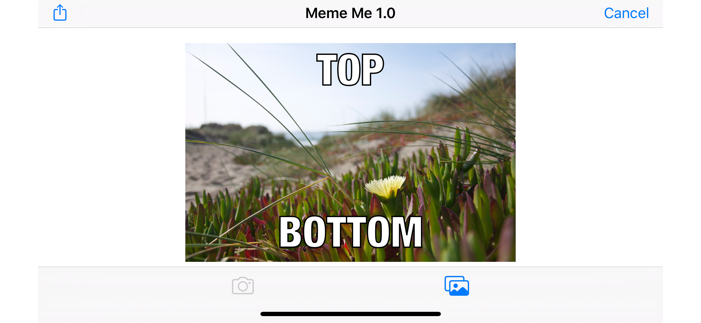

# iOS Create Meme App

An iPhone app that will allow users to take a picture, and add text at the top and bottom to form a meme. The user will be able to share the photo on Facebook and Twitter and also by SMS or email.

### Features

- Take a picture or Select from album
- Add top and bottom text
- Share new image

### Minimum Requirements

- Xcode 7.2
- Swift 2.0

### Screenshots

### License

Copyright (c) 2020 Zahidur
